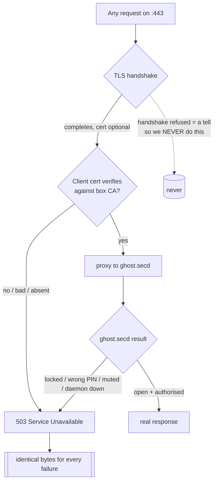
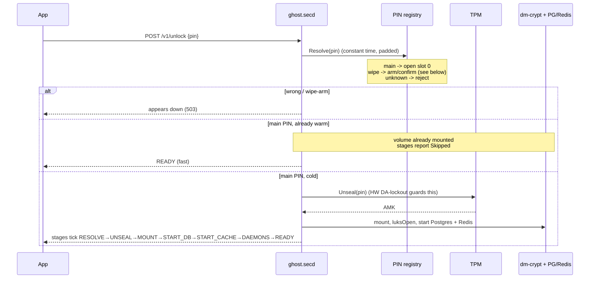
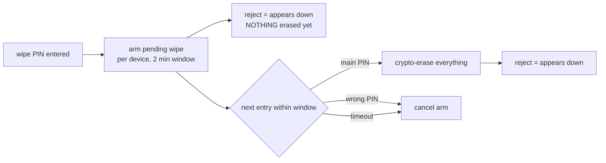
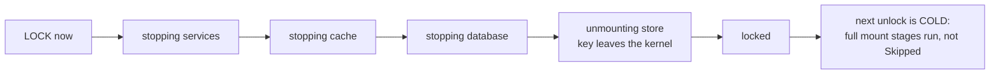

# Connection: how locking, unlocking, and PIN checking work

Two independent gates stand between the outside world and your data. Reaching the box is not the
same as getting in, and getting in is not the same as decrypting anything.

1. **The edge (nginx, mTLS).** A device certificate issued by *this box's own CA* is the access key.
   No cert, a bad cert, the wrong path, a down daemon , all of it answers the same plain `503`. From
   outside, the only observable fact is "this host answers TLS and says the service is unavailable",
   which is true of countless servers and reveals nothing: not that LocalGhost runs here, not that a
   box is enrolled, not whether your cert is any good.
2. **The lock (PIN + TPM).** Past the edge, the account master key (AMK) is sealed in the TPM under
   the PIN. The PIN is never the key and never derives it; the TPM hands the full-entropy AMK back
   only when the PIN satisfies the sealed object's auth. A powered-off disk is therefore useless to
   an attacker, and a short PIN is safe because the TPM's own dictionary-attack lockout , which root
   cannot reset without the lockout auth , is the real brute-force wall.

Everything below is how those two gates behave in each flow.

## The edge: everything is 503

Client-cert verification is `optional` at the TLS layer on purpose: if it were `on`, nginx would
reject a certless client *during the handshake*, and a handshake failure is itself a signal. Instead
the handshake always completes, and whether the cert verified is decided inside and collapses to the
same `503` as everything else. There is no public endpoint that answers anything else , not even
enrolment (that happens on the LAN, at first contact). It is deliberately hard to debug from the
outside. That is the point.

## Enrolment (first contact, by scan , no call)

Enrolment is done entirely by scanning the box's QR at first contact, on the LAN. The box generates
the device keypair, signs a device certificate with its own CA, and puts the box's LAN address, its
server-cert fingerprint, the signed **device certificate**, and its **private key** in the QR. The
phone scans it: it pins the box fingerprint (so a hostile network cannot MITM first contact) and
imports the device cert + key it will present on every later call. There is no enrolment *call* , the
certificate travels in the QR, screen-to-camera, never over the network. That is precisely why the
public face has no certless door to keep open.

Tradeoff, stated plainly: the device key is box-generated and imported rather than generated in the
phone's StrongBox and kept there, so it is not hardware-bound to the phone. In exchange it never
crosses a network and enrolment needs no open endpoint. Enrolment is a one-time, physically-present,
at-home action, which is the threat model this is chosen for.

## Unlock: PIN to mounted account

**Cold vs warm.** The first unlock after boot is *cold*: the TPM unseal happens, the volume mounts,
the databases start, and the app watches every stage run and complete. Later app-opens against an
already-mounted account are *warm*: the key is resident, the mount is up, and the heavy stages report
`Skipped`. The stage list and labels are identical for every account and every PIN , a real unlock
and a duress unlock stream the same steps; only the *speed* differs (warmth), never the *shape*.

## PIN checking: resolve, then act

`Resolve(pin)` checks the PIN against a fixed-size, random-padded registry in constant time, so
neither timing nor the stored blob reveals how many PINs exist, which one opens, or that a wipe PIN
exists at all. It returns one of three outcomes:

| Outcome    | What it means            | What the caller does                              |
|------------|--------------------------|---------------------------------------------------|
| **main**   | opens slot 0             | unseal (if cold) and mount                         |
| **wipe**   | the panic PIN            | arm, then confirm (below) , looks like a reject    |
| **unknown**| wrong PIN                | reject, cancel any armed wipe, appears down        |

Two walls stop brute force, and they are separated by design:

- **TPM dictionary-attack lockout** is the real limiter on the cold, first-unlock-per-boot unseal.
  It is coarse (N tries, then a long recovery) and root cannot clear it without the lockout auth
  (which is `pinAuth(PIN)` , derived from the one PIN you remember, held off the box). This is what
  protects a powered-off, stolen box.
- **The software layer** does *not* re-implement a wall on top; it only classifies (main / wipe /
  wrong) and short-circuits repeats, so a fat-fingered repeat never burns a hardware DA attempt.

## The wipe is a two-part sequence

A single stray entry of any PIN destroys nothing. The wipe is deliberate:

The wipe PIN alone only *arms*; the main PIN then *confirms*. Both present as a wrong-PIN reject, so
the armed state is never observable and adds no oracle. Someone who only knows the wipe PIN cannot
trigger it, and you cannot fat-finger your way into an erase.

## Lock: spin the box back down

Locking is the reverse of the mount, and it is *not* a wipe , no keys are destroyed, your data is
untouched. It stops the databases, unmounts, and `luksClose`s the mapping so the volume key leaves
the kernel, then revokes the session so every later call goes down until the next PIN.

The app shows these teardown steps ticking through, mirroring the mount. Because the volume is now
unmounted, the *next* unlock is genuinely cold , the mount stages run and complete rather than
reporting `Skipped` , which is the visible proof that it is a fresh start from nothing, not a warm
resume.

## What an outsider can and cannot tell

- **Can tell:** the host answers TLS on 443 and returns "service unavailable".
- **Cannot tell:** that this is a LocalGhost box, that an account is enrolled, whether their cert is
  valid, whether the daemon is up, whether a PIN was right or wrong, whether a wipe just happened, or
  whether notifications are muted. Every one of those is the same `503`.

Reachability is never access. Access is never decryption. And refusal is never distinguishable from
downtime.
